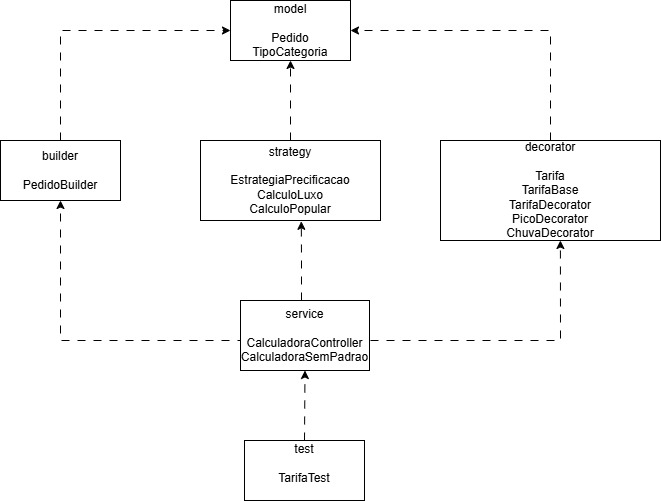
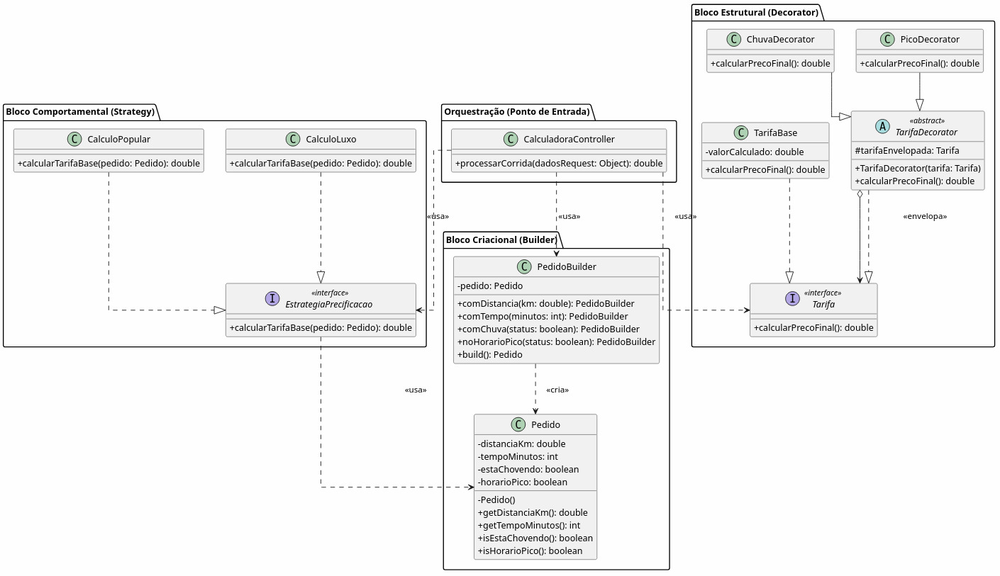
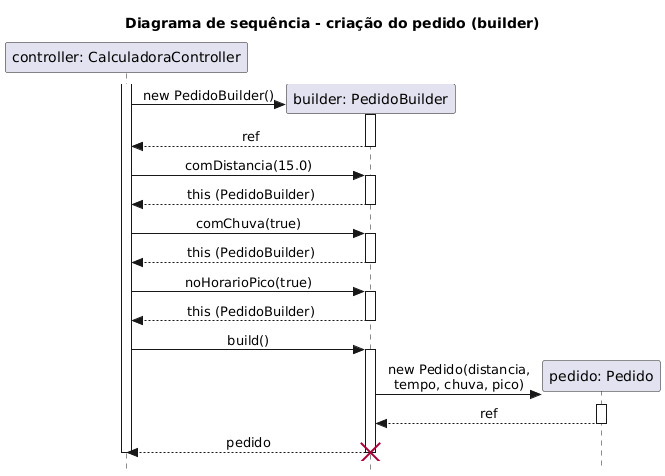
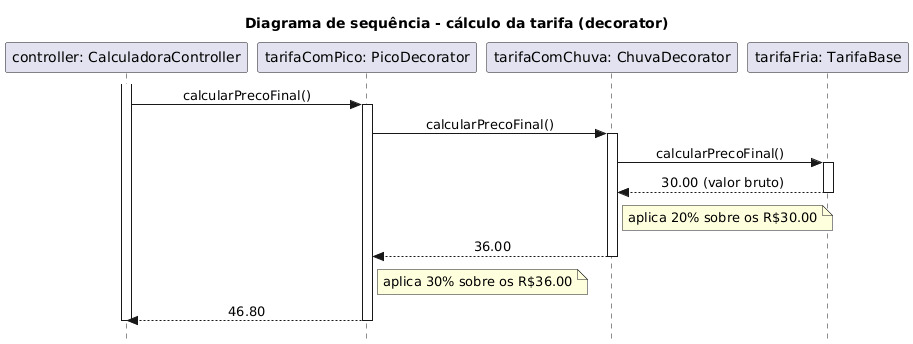

# 🚗 Motor de Precificação Dinâmica

Projeto desenvolvido para a disciplina de **Análise e Projeto de Software (APS)**, com foco na aplicação de **padrões de projeto GoF**, **princípios SOLID**, **GRASP**, **arquitetura em camadas** e **testes automatizados com JUnit 5**.

---

## 📌 Objetivo

O projeto simula um **motor de precificação dinâmica de corridas**, semelhante a aplicativos de mobilidade (ex: Uber), onde o valor final da tarifa pode variar de acordo com fatores contextuais em tempo real, como:

- 🛣️ Distância percorrida e tempo
- 🚘 Categoria do veículo (Popular ou Luxo)
- 🌧️ Condição climática (chuva)
- 🚦 Demanda (horário de pico)

O maior desafio resolvido por esta arquitetura foi evitar que o acúmulo de regras tarifárias resultasse em um código rígido, acoplado e de alta complexidade ciclomática (caracterizado por longas cadeias de `if/else`).

---

## 🧩 Padrões de Projeto Aplicados (GoF)

Para garantir flexibilidade e manutenibilidade, o sistema foi estruturado com três padrões fundamentais:

### 1. Creational Pattern — Builder
Utilizado (`PedidoBuilder`) para encapsular a construção complexa de um `Pedido`, evitando construtores longos e garantindo que o objeto de domínio seja instanciado apenas em um estado consistente.

### 2. Behavioral Pattern — Strategy
Aplicado (`EstrategiaPrecificacao`, `CalculoPopular`, `CalculoLuxo`) para isolar a regra de cálculo da tarifa base dependendo da categoria do veículo. Permite adicionar novas categorias no futuro sem alterar o motor principal.

### 3. Structural Pattern — Decorator
Utilizado (`TarifaDecorator`, `ChuvaDecorator`, `PicoDecorator`) para adicionar taxas dinâmicas e cumulativas ao preço base em tempo de execução, eliminando a necessidade de múltiplas subclasses ou blocos condicionais.

---

## Diagramas UML do projeto

**Diagrama de Pacotes:**


**Diagrama de Classes:**


**Diagramas de Sequência:**



---

## 📊 Métricas e Qualidade de Código (Análise Estática)

A eficácia da refatoração e da aplicação dos padrões foi validada por ferramentas de análise estática (*MetricsReloaded*), comprovando a eliminação de *code smells*:

- **Complexidade Ciclomática:** Reduzida de $CC = 3$ (no código legado `CalculadoraSemPadrao`) para **$CC = 1$** nas classes refatoradas (Decorators e Strategies).
- **Acoplamento Aferente ($C_a = 6$):** A interface principal (`Tarifa`) possui alto índice de componentes dependentes, provando a estabilidade da abstração.
- **Acoplamento Eferente ($C_e = 2$):** As classes de estratégia desconhecem os modificadores de preço, garantindo altíssima coesão e modularidade.

---

## ⚙️ Princípios SOLID e GRASP Aplicados

- **SRP (Responsabilidade Única):** Cada decorador isola um cálculo matemático específico.
- **OCP (Aberto/Fechado):** O sistema está aberto para receber uma nova taxa (ex: `FeriadoDecorator`) sem que o motor principal precise ser modificado.
- **DIP (Inversão de Dependência):** O sistema depende de abstrações (`Tarifa` e `EstrategiaPrecificacao`) em vez de implementações concretas.
- **Information Expert (GRASP):** A classe `Pedido` concentra todos os dados necessários da corrida em um estado imutável (`final`).
- **Controller (GRASP):** A classe `CalculadoraController` orquestra o fluxo sem absorver o peso das operações matemáticas.

---

## 🧪 Testes Automatizados (TDD)

O projeto utiliza **JUnit 5** para assegurar a confiabilidade das transformações matemáticas.

### Cenários validados:
✅ Injeção estrita da tarifa base.  
✅ Aplicação isolada da taxa de chuva (+15%).  
✅ Aplicação isolada da taxa de horário de pico (+25%).  
✅ **Comportamento cumulativo:**

```text
R$ 20,00 (Base)
→ chuva (+15%)
→ pico (+25%)

Resultado validado pelas asserções: R$ 28,75
```

---

## 📂 Estrutura de Pacotes

A arquitetura reflete a separação estrita de responsabilidades:

```text
src/
├── builder/    # Construção consistente do objeto
├── decorator/  # Modificadores de preço dinâmicos
├── model/      # Entidades imutáveis do domínio
├── service/    # Controladores e log de código legado
├── strategy/   # Cálculos base por categoria
├── test/       # Suíte de validação TDD (JUnit)
└── Main.java   # Ponto de entrada
```

---

## ▶️ Como Executar

**1. Clone o repositório:**

```bash
git clone https://github.com/SEU-USUARIO/MotorPrecificacao.git

```

**2. Abra a IDE:** Abra o diretório no IntelliJ IDEA ou Eclipse.

**3. Execute a aplicação:** Rode a classe `Main.java` para ver a orquestração do *Builder* com o *Controller*.

**4. Execute os testes:** Rode a classe `TarifaTest.java` para validar a suíte do JUnit.

---

## 👥 Desenvolvedores

Projeto de **Arquitetura e Projeto de Software (APS)** - Universidade Católica de Pernambuco (UNICAP).

* João Pedro Catunda de Moraes
* Maria Clara de Oliveira Barbosa
* Maria Luiza Monteiro
* Jhon Victor Ramos Martins
